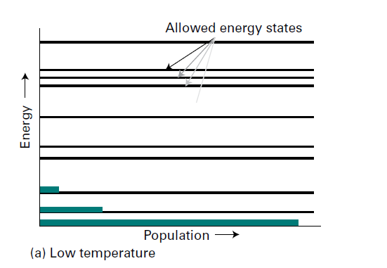
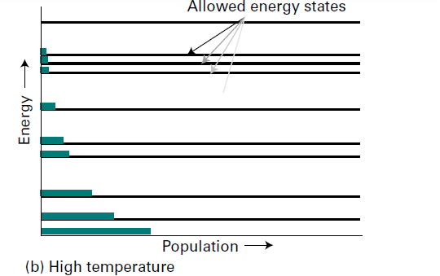

# 绪言
## 第 1 讲-预备知识

热力学:
能量从一种形式到另一种形式的转变可用热力学(thermodynamics)定律来描述，它们适用于由大星原子和分子所组成的宏观物质。热力学“第—定律”是有关转变中所涉及的能量的数星的一种表述，而热力学“第二定律”则是—种有关能量散布的陈述。

量子力学:
根据该理论，与一个粒子运动相关的能量是"量子化"，即能量局限千一定的数值，而不能取任意值。可以出现三种不同类型的运动：平动（通过空间的移动）、转动（取向的改变）和振动（键的周期性伸缩和弯曲）。

统计力学:
Boltzmann distribution-
$$N_i\propto\mathrm{e}^{-\varepsilon_i/kT}$$
 
宏观物质由大量分子所组成，每个分子都处在某一许可能态上
用于解释原子能级跃迁

当温度较低时，大多数分子占据低能量状态，这一事实可用来解释化合物的存在及液体和固体的留存。

在高温时，高度激发的能级也变得可及；这可以用来说明—物质获得能力转变成另—物质的反应可能性。

