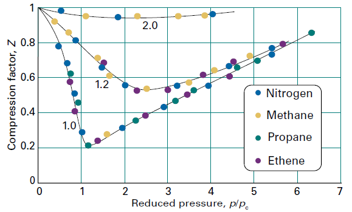

# 第1章气体
## 第 2 讲-完美气体

广度量：质量，体积
强度量：温度，压力, 质量密度（广度量/广度量=强度量,摩尔性质都是强度量：$X_m=X/n$）

完美气体·：
1、分子体积与气体体积相比可以忽略不计；
2、分子之间相互作用力相同且为零；

### 状态方程
**状态方程**：$$pV=nTR$$
等温线 pV=Constant

完美气体的 pVT 面

### 气体化合物
道尔顿分压定律
在任何容器内的气体混合物中，如果各组分之间不发生化学反应，则每一种气体都均匀地分布在整个容器内，它所产生的压强和它单独占有整个容器时所产生的压强相同。
$$\begin{aligned}P=\sum_{i=1}^NP_i=\frac{nRT}{V}\\
P_{1}=\frac{n_{1}RT}{V}\\
x_1=\frac{n_{1}}{n}=\frac{P_{1}/RT}{PV/RT}=\frac{P_{1}}{P}\\
P_{1}=Px_{1}\end{aligned}$$
### **概念清单**
1.物质的**物理状态**，即物理条件，由其物理性质决定。***结构决定性质***
2.**力平衡**是共享的可移动隔板的两侧压力相等的条件。
3.**状态方程**是关联确定物质状态的各变量的方程。
4.波义耳定律和查尔斯定律都是极限定律，其仅在某一特定极限（这里是 $p\rightarrow0$)时才严格成立。
5.**等温线**是指图中对应于同一温度的曲线。
6.**等压线**是指图中对应于同一压力的曲线。
7.**等容线**是指图中对应于同一体积的曲线。
8.**完美气体**是指在所有条件下均服从完美气体定律的气体
9.**道尔顿定律**指出，（完美）气体混合物的压力是其中各组分占据相同体积时所具有的压力的总和。
## 第 3 讲-动理论模型

气体动理论模型（kinetic theory of gas）
分子运动论（kinetic molecular theory）***KMT***
### 模型
**气体动理论的核心思想**：气体由**可忽略大小**，并且做无规则运动的分子所组成，**气体的能量仅来源于分子的动能**，分子间的碰撞遵循经典力学定律。
##### 速率分布推导
假设：
气体分子做**无规则无休止的运动**，并且运行形式服从经典力学定律；
相对于分子碰撞时的运动距离，分子的直径很小，可以忽略以将分子假设为“**质点**”；
分子间仅通过**弹性碰撞**发生相互作用。

麦克斯韦-玻尔兹曼速率分布
$$f(\nu)=4\pi\left(\frac{M}{2\pi RT}\right)^{3/2}\nu^2\mathrm{e}^{-M\nu^2/2RT}$$
M 摩尔质量
T 绝对温度

方均根速率：$v_{rms}=\left( \frac{3RT}{M} \right)^\frac{1}{2}$
$$pV=\frac{1}{3}nMv_{rms}^2$$
推到得到 $$pV=nTR$$
##### 平均值
最概然速率：$v_{mp}$

平均速率：$v_{mean}$

方均根速率：$v_{rms}$

平均相对速率：$v_{rel}$

### 碰撞
#### 碰撞频率推导

碰撞频率 z
$$z=\frac{\sigma v_\mathrm{rel}p}{kT}$$
#### 平均自由程
平均自由程 $\lambda$
$$\lambda=\frac{\nu_{\mathrm{rel}}}{z}=\frac{kT}{\sigma p}$$

### **概念清单**
1.**气体分子动理论**KMT模型仅考虑来自分子动能的能量贡献。
2.该模型的重要结论包括压力和**方均根速率**的表达式。
3.**麦克斯韦-玻耳兹曼速率分布**给出了在指定速率范圉内的分子分数。
4.碰撞频率等于一定时间间隔内分子碰撞的平均次数除以该时间间隔的时长。
5.平均自由程是分子在两次碰撞之间移动的平均距离。

## 第 4 讲-实际气体

### 实际气体与完美气体的偏离
实际气体与完美气体定律的偏离是因为分子间的相互作用。
分子间的排斥力有助于膨胀，吸引力则有助于压缩。

##### 压缩因子

压缩因子 $Z=\frac{V_\mathrm{m}}{V_\mathrm{m}^\circ}$

$$Z=\frac{pV_{m}}{RT}$$
0℃下几种气体的压缩因子 Z 随压力的变化。
气体压缩因子图

##### 维里系数
注意到完美气体 Z=1，且 $\frac{\mathrm{d}Z}{\mathrm{d}p}=0$
其余曲线在 $p\rightarrow0$ 时 $Z\rightarrow1$，但是斜率不同。
$p\rightarrow0$ 时，真实气体的状态方程可能与完美气体定律一致，但在该极限时，并非所有性质都必然与完美气体一致。
$$\frac{\mathrm{d}Z}{\mathrm{d}p}=B^{\prime}+2pC^{\prime}+\cdots\to B^{\prime}$$
此时由于 $B^{\prime}$ 不一定等于 0，此时 $\frac{\mathrm{d}Z}{\mathrm{d}p}=B^{\prime}$
又由于第二维里系数 $B^{\prime}$ 与温度有关， $p\rightarrow0$ 时，故存在波义尔温度 $T_B$ 下, $B^{\prime}=0$ ，此时真实气体 $\frac{\mathrm{d}Z}{\mathrm{d}p}=0$，此时实际气体与完美气体性质一致。

在**波义耳温度**下，气体在几百千帕的范围内比较好的符合波义耳定律。

##### 临界常数

$CO_2$ 临界温度 $T_r$ =31.4℃，只有在小于等于这个温度下, 气体才能被压缩成液体。

如果在 $T_c$ 时压缩，则不会出现分隔两相的界面，并且等温线水平部分两端的体积合并成一点，即气体的临界点 (critical  point)。临界点的压力和摩尔体积称为物质的临界压力(critical pressure) $P_c$ 和临界摩尔体积 (critical molar volume) $V_c$ _。总体来说， $T_c$ 、 $P_c$ 和 $V_c$  是物质的临界常数 (critical Constant)

在 $T_c$ 及其以上温度时，样品为占据整个容器的单相。根据定义，这样的相为气体。因此，高于临界温度时，物质的液相不可能形成。当  $T>T_c$时，充满整个容器的单相可能比通常认为的气体稠密得多，因此更倾向千称其为**超临界流体**(supercritical fluid)。

因此系统温度高于临界温度 $T_r$ 时，物质的液相不可能形成。
### 范德华方程
##### 方程形式
$$p=\frac{nRT}{V-nb}-a\frac{n^{2}}{V^{2}}$$

用摩尔体积 $V_m= \frac{V}{n}$ 表示
$$p=\frac{RT}{V_\mathrm{m}-b}-\frac{a}{V_\mathrm{m}^2}$$
##### 方程特性

范德华方程允许的，可能的状态面

范德华等温线：

在低于临界温度 $T_r$ 下，范德华方程曲线出现震荡寄范德华环：压力增加导致体积增加
对此使用麦克斯韦构造（一种数学方法）解决。

特性总结：
1.在高温和大的摩尔体积下，可得到完美气体等温线。
2.当吸引力和排斥力影响达到平衡时，液体和气体共存。
3.临界常数与范德华系数有关。

针对范德华方程，使用拐点进行数学分析得到临界常数
$$\frac{\mathrm{d}p}{\mathrm{d}V_{\mathrm{m}}}=-\frac{RT}{\left(V_{\mathrm{m}}-b\right)^{2}}+\frac{2a}{V_{\mathrm{m}}^{3}}=0$$$$
\frac{\mathrm{d}^2p}{\mathrm{d}V_\mathrm{m}^2}=\frac{2RT}{\left(V_\mathrm{m}-b\right)^3}-\frac{6a}{V_\mathrm{m}^4}=0$$
解得
$$V_\mathrm{c}=3b\quad p_\mathrm{c}=\frac{a}{27b^2}\quad T_\mathrm{c}=\frac{8a}{27bR}$$
临界压缩因子
$$Z_c=\frac{P_cV_c}{RT_c}=\frac{3}{8}=0.375$$

##### 对比状态原理
对比量 
$$V_\mathrm{r}=\frac{V_\mathrm{m}}{V_\mathrm{c}}\quad p_\mathrm{r}=\frac{p}{p_\mathrm{c}}\quad T_\mathrm{r}=\frac{T}{T_\mathrm{c}}$$
在相同的对比体积和对比温度下，不同的真实气体具有相同的对比压力。这一现象称为对比状态原理 (principle of corresponding States)。
该原理只是近似的，使用条件有限，最适用于由球形分子组成的气体；当分子为非球形或极性时，该原理不适用，有时还相当糟糕。
**对比状态原理图**

### **概念清单**
1.通过引入**压缩因子**来归纳与完美气体行为的偏离程度。
2.**维里状态方程**是完美气体状态方程的经验拓展式，它总结了实际气体在一系列条件下的行为。
3.实际气体的等温线引入了**临界温度**的概念，仅当气体温度等于或低于其临界温度时，气体才能通过压缩液化。
4.**范德华方程**是一个用两个参数 a，b表示的、实际气体状态的模型方程，其中一个系数（a) 代表分子的吸引，另一个系数（b) 表示分子的排斥。
5.范德华方程抓住了真实气体行为的一般特征，包括其临界行为。
6.通过用**对比变量**来表示状态方程，实际气体的性质可被协调统一。
