# 第 2 章热力学第一定律
## 第 5 讲-内能

热力学研究对象：系统和环境

内能是**状态函数**。
状态函数的数值大小只取决于系统的当前状态，而与系统如何变化到当前这个状态的方式没有关系。换句话说，内能是确定系统当前状态的那些状态变量的函数。系统任一状态变量 (如温度，压力) 的变化，可能会引起内能的变化。内能是状态函数，这一点具有非常重要的意义。

系统分类
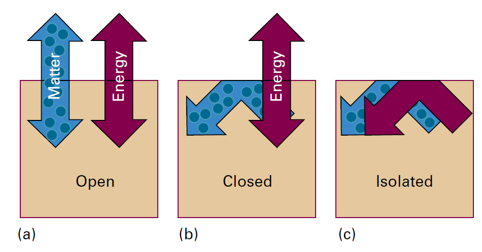

与环境既有能量交换又有物质交换的系统称为开放系统，简称开系；
与环境有能量交换但没有物质交换的系统称为封闭系统，简称闭系；**可以进行做功与热交换**
与环境没有任何相互作用的系统称为孤立系统；**没有做功与热交换**
### 功、热和能量

Work-功
Energy-能量-系统做功的能力
Heat-热

#### 分子诠释

热运动：分子的无序运动
传热：当系统向环境放热时，这种热量传递会使环境中原子的无序运动程度增大。环境向系统传递能量则利用的是环境中的无序运动 (热运动)
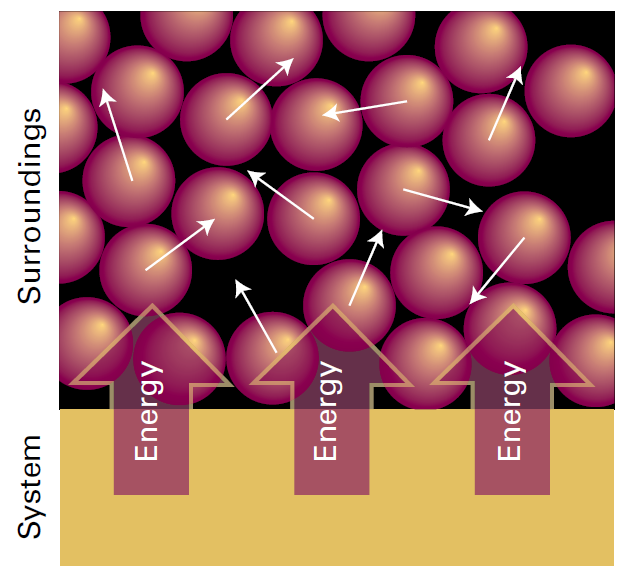

做功：系统做功驱动环境中分子的有序运动 (例如，图中显示的原子可能是正在上升的重物中的一部分原子。原子在下落重物中的有序运动会对系统做功)

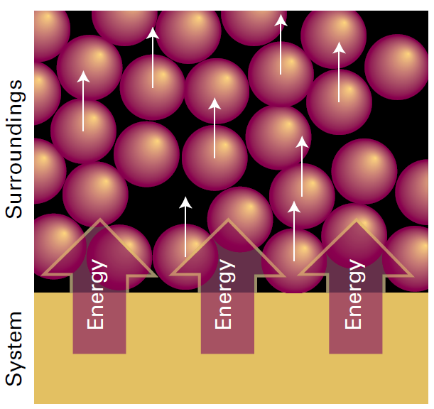

因此功可以**全部转化成**热，热只能**部分转化成**功。
### 内能

热力学中，系统的总能量称为内能 (internal energy) U。系统的内能是系统中所有构成粒子（原子、离子或分子）的**全部动能和势能之和**。系统整体的宏观运动，如系统随地球一起进行的绕日运动也具有动能，**但热力学中的内能不包括系统整体的宏观运动动能**，也就是说，**系统的内能只是指系统“内部”的能量**。系统从某一始态变化到某一终态，内能就从 $U_i$ 变化到 $U_f$，相应的内能变化量用 $\Delta U$ 表示：
$$
\Delta U=U_i-U_f
$$
$$C_{V}=\left(\frac{\partial V}{\partial T}\right)_{V}，U=f(T,V)$$
#### 分子诠释
一个分子具有一定数目的运动自由度，如平动自由度、转动自由度或振动自由度。
许多物理性质或化学性质与这些运动形式有关。如：某个化学键上集中了很高的能量，如强烈振动，化学键就可能会断裂。系统温度升高，系统的内能就增大，分子就会分布到更高的能级。

根据**经典力学**可以得到**能量均分定理**

能量均分定理

##### **能量均分定理**

单原子气体分子只有平动，多原子气体分子不仅有**平动**，还有**转动**与**振动**。

假设一个分子由 n 个原子组成，每个原子都能在 x、y、z 方向上产生位移，则一个分子的总自由度是 3 n。

分子的运动由平动、转动和振动三部分组成。平动可视为分子的**质心**在空间的位置变化，转动可视为分子在**空间取向**的变化，振动则可看成分子在其质心和空间取向不变时，分子中**原子相对位置的变化**。

刚性分子可以发生平动和转动，刚性线性分子与刚性非线性分子的平动自由度都为 3，刚性线性分子的转动自由度为 2，刚性非线性分子的转动自由度为 3。由上可得出，非刚性线性分子的振动自由度为 3 n-6，刚性线性分子的振动自由度为 3 n-5.

由温度公式 $\varepsilon_{kt}^{-}=\frac{3}{2}kT$ 可知，具有三个平动自由度的单原子气体的平均平动动能为 $\frac{3}{2}kT$ ，这给了我们提示，从而推广到其他自由度，得到能量均分定理。

能量均分定理：气体分子每个自由度的平均能量都等于 $\frac{kT}{2}$ .

**能量均分定理是对大量分子统计平均的结果，是一个统计规律。**

##### **完美气体内能**

气体的内能是由所有分子的动能（平动动能、转动动能、振动动能）以及分子间相互作用的势能之和。完美气体不考虑分子间的相互作用，故完美气体的内能就是它所有分子的动能之和。

单原子分子气体的内能：$E=\frac{3}{2}kT\times {N_A}=\frac{3}{2}\frac{R}{N_A}T\times {N_A}=\frac{3}{2}RT$

刚性双原子分子气体的内能：$E=\frac{5}{2}kT\times {N_A}=\frac{5}{2}\frac{R}{N_{A}}T\times {N_A}=\frac{5}{2}RT$

刚性多原子分子气体的内能：$E=\frac{6}{2}kT\times {N_A}=\frac{6}{2}\frac{R}{N_A}T\times {N_A}=\frac{6}{2}RT=3RT$

**由此可知，对摩尔数一定的完美气体，其内能的变化只与系统温度的改变量有关，而与具体过程无关。**

对处于热平衡的单原子气体分子系统，分子内能由平动贡献：
$E_\text{平动}=3\times\frac{1}{2}kT=\frac{3}{2}kT$
摩尔平动能为 $E_{\text{平动,}m}=\frac{3}{2}kT{\times}N_{\mathrm{A}}=\frac{3}{2}RT$

完美气体的体积对内能没有影响：完美气体分子间没有相互作用，因此分子间的距离对气体系统的能量没有影响，也就是说：**完美气体的内能与体积无关**
$$\frac{dU}{dV}=0$$
#### 热力学第一定律数学表达式
**功和热是改变系统内能的两种等价方式**
热力学第一定律：
系统在绝热状态时，功只取决于系统初始状态和结束状态的能量，和过程无关。
**孤立系统的内能是守恒的**。
数学表达式：
$$\Delta U=q+w$$$$\mathrm{d}U=\mathrm{d}q+\mathrm{d}w$$
**符号**：系统对环境传热和做功，q 和 w 取负，反之同理。

### 功

**膨胀功**：由体积变化所引起的功。
膨胀功包括气体对抗大气压力的膨胀过程产生的功。

数学表达式：
$$\mathrm{d}w=-p_{\mathrm{ex}}\mathrm{d}V$$
$$w=-\int_{V_{i}}^{V_{i}}p_{\mathrm{ex}}\mathrm{d}V$$
#### **等外压膨胀**
在整个膨胀过程中外压 $p_{\mathrm{ex}}$保待不变

$$w=-p_{\mathrm{ex}}\int_{V_{i}}^{V_{i}}\mathrm{d}V=-p_{\mathrm{ex}}(V_{\mathrm{f}}-V_{\mathrm{i}})$$
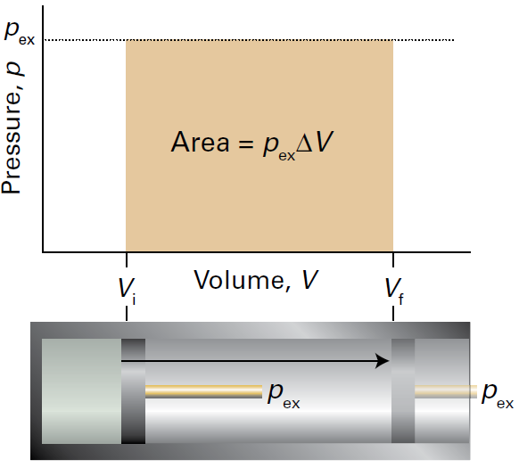
**自由膨胀**： $p_{\mathrm{ex}=0}$ 条件下，系统对环境不做功。
#### **可逆膨胀**
热力学中，若通过一个变量的无穷小改变，可使变化逆转，则该变化称为可逆变化 (reversible change)。这里的关键词“无穷小“，将 ”可逆”这个词的一般意义凝练为可以改变方向，强调的是**方向变化的可逆**。温度相同的两个系统间的热平衡（thermal equilibrium）就是一个可逆性实例，这样的两个系统之间发生的传热过程是可逆的，因为如果其中任一系统的温度发生无穷小降低，热就会流入温度较低的系统；反之，如果其中任一系统的温度发生无穷小升高，热就会流出温度较高的系统。显然，可逆性和平衡之间存在非常密切的关系：处干平衡的系统之间才有望发生可逆变化。
##### **等温可逆膨胀**
对于完美气体 $p=nRT/V$
$$w=-nRT\int_{V_\mathrm{i}}^{V_\mathrm{f}}\frac{\mathrm{d}V}{V}=-nRT\ln\frac{V_\mathrm{f}}{V_\mathrm{i}}$$
可以在 $p-V$ 图中表示计算的结果，在 $p-V$ 图中，过程中做功的大小等于等温线 $p=nRT/V$ 下的面积。图中叠加显示的矩形面积代表不可逆膨胀过程的做功的大小，**这个不可逆膨胀过程对抗的外压恒等于可逆膨胀过程所到达的终态压力**。可逆过程中做的功较大 (图中显示的面积较大), 这是因为可逆膨胀过程中的每一步，外压始终保持与内压相等，系统的驱动力一点都不浪费。膨胀过程中做的功不可能比可逆功大，因为过程中的任一点，外压哪怕比内压大一点点，产生的结果都是压缩。根据这里的讨论结果可以看出，在 $p>p_\mathrm{ex}$ 的情况下，系统有一部分驱动力没有发挥作用，**只有在可逆过程中，才能实现系统在给定的始态和终态之间做最大功**。
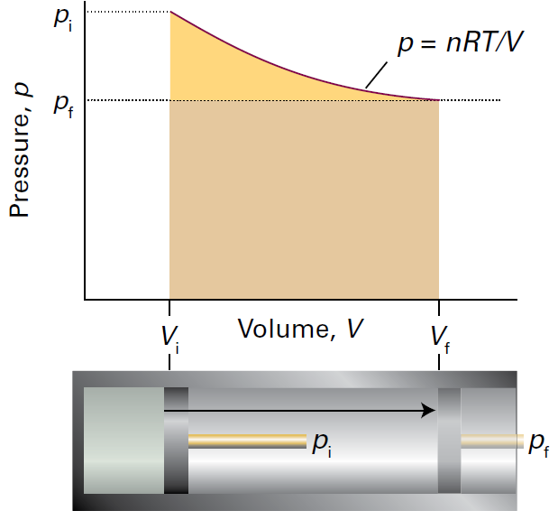
完美气体等温可逆膨胀过程中做功的大小等于等温线 p=nRT/V 下的面积。在对抗等外压 (终态压力) 下的不可逆膨胀过程中做功的大小等于较暗的矩形区域面积 (注意，可逆功大于不可逆功)
### 热交换

一般情况下，系统的内能变化为
$$\mathrm{d}U=\mathrm{d}q+\mathrm{d}w_{\exp}+\mathrm{d}w_{\mathrm{add}}$$
等容系统不会产生膨胀，这种情况下 $\mathrm{d}w_{\exp}=0$，如果系统也不做任何其他形式的功（例如，如果系统不是一个连接到电动机上的电池），则还会有 $\mathrm{d}w_{add}=0$ ，在这些条件下：
$$\mathrm{d}U=\mathrm{d}q$$
$$\Delta U=q_{v}$$
#### 量热法
**恒容量热计**是一种**测量热量传递**的装置
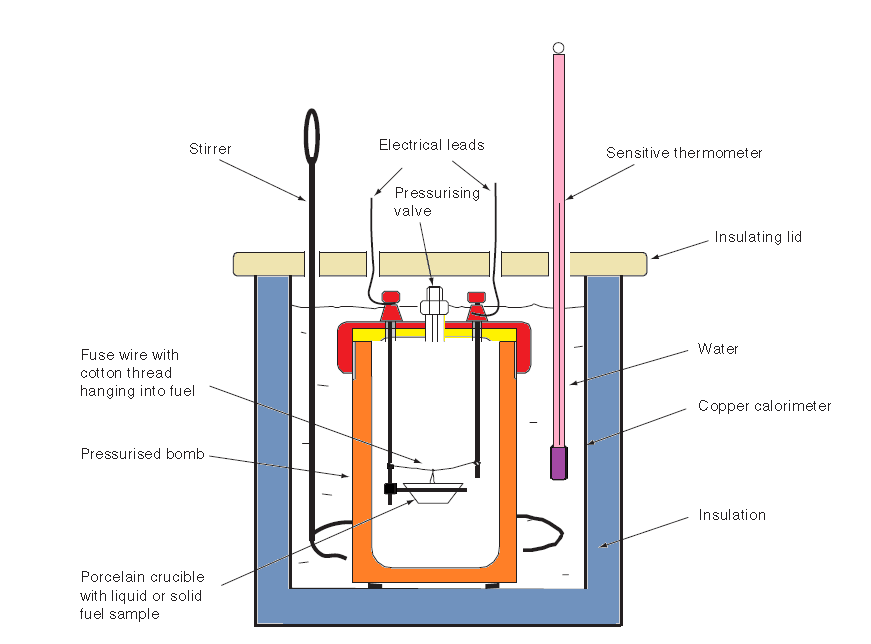
**理想情况**下可以保证系统恒容绝热
将一定量的试样置于密封的氧弹中，在充足的氧气条件下，令试样完全燃烧，燃烧所放出的热量被氧弹及其周围的一定量的水（内筒水）吸收，水的温升与试样燃烧释放的热量成正比。在规定的条件下预先标定出量热仪的热容量。要测定发热量时，只要严格按照标定热容量的条件进行试验，并准确测定出试样燃烧后内筒水的温升值，采用科学的方法，即可计算出试样的发热量。
**实际情况**下只能保证系统恒容但不绝热
在恒温式量热系统中，由于外筒水和室温之间和内筒与外筒之间实际存在着热交换，给发热量的精确计算带来了麻烦。因此，为了校正由热交换引起的计算误差，在建立发热量计算数学模型时引入了冷却系数 K 和综合常数 A。K 和 A 可通过对仪器进行标定计算得出。
$$q=C\Delta T$$

#### 恒容热容

可以证明，单原子完美气体分子内能：[第2章热力学第一定律](学习/项目/物理化学/Askins‘%20PHYSICAL%20CHAMISTRY/第2章热力学第一定律.md#完美气体内能)
其中单原子分子气体的内能：$E=\frac{3}{2}kT\times {N_A}=\frac{3}{2}\frac{R}{N_A}T\times {N_A}=\frac{3}{2}RT$
$$C_V=\left(\frac{\partial U}{\partial T}\right)_V$$
$$\mathrm{d}U=C_V\mathrm{d}T$$
恒容条件下系统不会产生膨胀，这种情况下 $\mathrm{d}w_{\exp}=0$
$$\mathrm{d}U=\mathrm{d}q$$
$$\Delta U=\int_{T_1}^{T_2}C_V\mathrm{d}T=C_V\int_{T_1}^{T_2}\
mathrm{d}T=C_V\overbrace{(T_2-T_1)}^{\Delta T}$$
$$\Delta U=C_V\Delta T$$
### 概念清单
1.对抗反向作用力的运动就会产生功。
2.能量是做功的能力。
3.放热过程是系统向环境释放热量的过程。
4.吸热过程是系统从环境吸收热量的过程。
5.热是因温度差产生的能量传递过程。
6.用分子术语来讲，功是利用环境中原子的有序运动的一种能量传递，热则是利用环境中原子的无序运动的一种能量传递。
7.内能是系统内部的总能量，是一个状态函数。
8.温度升高，内能增大。
9.均分定理可用于估计每种经典运动形式对内能的贡献量。
10.热力学第一定律指出隔离系统的内能是守恒的。
11.自由膨胀（即对抗零外压膨胀）不做功。
12.如果某变量的无穷小变化可使变化逆转，则此变化是可逆变化。
13.为了实现可逆膨胀，外压在膨胀的每个阶段都要与系统压力无限接近。
14.定容条件下传递的热量等干系统的内能变化。
15.量热法用于测量热交换。

## 第 6 讲-焓

当系统发生任意体积变化时，内能变化并不等于系统-环境间传递的热。例如，系统在等压条件下发生膨胀或压缩时，系统从环境中吸收的热中一部分会通过做功方式重新回到环境中, 这就导致 $dU<dq$。等压条件下，系统-环境间传递的热等于系统另一个热力学性质的变化量，这个热力学性质就是“熵”。

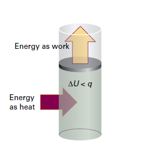

焓 H 的定义为 $H=U+pV$
$$\begin{aligned}C_{p}&=\left(\frac{\partial H}{\partial T}\right)_{p},H=f(T,p)\end{aligned}$$

焓是**状态函数**。
状态函数的数值大小只取决于系统的当前状态，而与系统如何变化到当前这个状态的方式没有关系。焓是状态函数，这一点具有非常重要的意义。

### 焓变与热交换
焓变是定压条件下系统与环境间交换的热

$\mathrm{d}H=\mathrm{d}U+p\mathrm{d}V+V\mathrm{d}p=\mathrm{d}U=\mathrm{d}q+\mathrm{d}w+p\mathrm{d}V+V\mathrm{d}p$

定压条件下 $\mathrm{d}w=-p_{\mathrm{ex}}\mathrm{d}V$，$V\mathrm{d}p=0$
$\mathrm{d}H=\mathrm{d}q$（定压, 无额外功）
#### 量热法
研究等压过程的量热仪称为**等压量热仪**
另外一种研究 $\Delta H$ 的方法是使用弹式量热计测出内能变化，然后根据 $H=U+pV$，计算 $H_{\mathrm{m}}=U_{\mathrm{m}}+pV_{\mathrm{m}}\approx U_{\mathrm{m}}$
因此, 若某变化过程只涉及固体或液体, 则过程引起的和就几乎相等, 这些过程对应的体积变化很小, 过程中系统对环境做的功可忽略不计, 因此变化过程中产生的热就全部被保留在系统中。

对于完美气体 $H=U+pV=U+nRT$ 
这个关系意味着，等温条件下产生或消耗气体的
$\Delta H=\Delta U+\Delta n_\mathrm{g}RT$
#### 恒压热容
$$\begin{aligned}C_{p}&=\left(\frac{\partial H}{\partial T}\right)_{p},H=f(T,p)\end{aligned}$$

$$\mathrm{d}H=C_p\mathrm{d}T$$

$$\Delta H=\int_{T_1}^{T_2}C_p\mathrm{d}T=C_p\int_{T_1}^{T_2}\mathrm{d}T=C_p\overbrace{(T_2-T_1)}^{\Delta T}$$
$$\Delta H=C_p\Delta T$$

### 热容之间的关系
大多数系统是在等压下加热膨胀，在这种情况下，系统对环境做功，因此膨胀过程中系统吸收的热量会有一部分又通过做功的方式被还回到环境中，导致在等压条件下加热时系统温度的升高值会比等容条件下低一些。吸收同样的热量所产生的温度升高值较小时，就意味着系统有更大的热容。因此，大多数情况下，系统的定压热容 $C_p$ 都大于其定容热容 $C_V$。完美气体的定压热容和定容热容之间存在一个简单关系：$C_p-C_V=nR$
### 概念清单
1.定压热等于系统的熔变。
2.焓变可以在定压量热仪中进行测量。
3.定压热容等于焓随温度的变化率。

## 第 7 讲-热化学

### 标准焓变
有关的焓变数据通常都是在标准条件下发生的过程的焓变值，标准焓变( standard enthalpy change ) $\Delta H^{\Theta}$ 就是标准状态的始态物质转变为标准状态的终态物质的过程中产生的焓变：
给定温度下某物质的**标准状态**( standard state)就是1 bar压力下的纯态。
一般常规热力学数据都是 298.15℃下的数据。

### 焓变分类
#### 物理焓变
标准蒸发焓
标准熔化焓
#### 化学焓变
***标准反应焓***：使用盖斯定律将不同标准反应焓 $\Delta_{\mathrm{r}}H^{\Theta}$ 数据组合起来
$$\Delta_{\mathrm{r}}H^{\Theta}=\sum_\text{产物}{\nu}H_{\mathrm{m}}^{\Theta}-\sum_\text{反应物}{\nu}H_{\mathrm{m}}^{\Theta}$$
由于标准摩尔焓的绝对值无法测量，因此标准反应焓难以通过测量获得
**盖斯定律**（英语：Hess's law），又名反应热加成性定律（the law of additivity of reaction heat）：若一反应为二个反应式的代数和时，其反应热为此二反应热的代数和。也可表达为在条件不变的情况下，化学反应的热效应只与起始和终了状态有关，与变化途径无关。它是由俄国化学家盖斯发现并用于描述物质的热含量和能量变化与其反应路径无关，因而被称为盖斯定律。
标准燃烧焓是一种特殊的标准反应焓
***标准生成焓***：
某物质的标准生成熔（standard enthalpyof formation) $\Delta_{\mathrm{f}}H^{\Theta}$, 是指由构成该化合物指定**参考态**的单质生成该化合物的标准反应熔。单质的指定**参考态** (reference state)是指给定温度和 1 bar 压力下的最稳定状态。
例如，298 K 下氮的参考态是气态 $N_{2}$，汞的参考态是液态汞，碳的参考态是石墨，锡的参考态是白锡（金属）。在关于参考态的一般规定中，有一个元素是例外的，就是磷的参考态被确定为白磷，尽管磷元素的这种同素异形体并不是**最稳定形式**，但白磷却是最容易重复制得的单质磷。标准生成焓表示的是每摩尔化合物分子或分子单位（对于离子物质）的焓。
任一温度下氢离子的标准生成焓被定义为零：
$$\Delta_\mathrm{f}H^\Theta(\mathrm{H}^+,\mathrm{aq})=0$$
$$\Delta_{\mathrm{r}}H^{\Theta}=\sum_\text{产物}{\nu}\Delta_{\mathrm{f}}H^{\Theta}-\sum_\text{反应物}{\nu}\Delta_{\mathrm{f}}H^{\Theta}$$
### 反应焓与温度的关系

已测得许多不同温度下的标准反应焓数据，但是，在缺少相关实测数据的清况下，也可以根据物质的热容数据和其他温度下的标准反应焓数据，计算目标温度下的标准反应焓。
**基尔霍夫定律**
$$\Delta_\mathrm{r}H^\Theta(T_2)=\Delta_\mathrm{r}H^\Theta(T_1)+\int_{T_1}^{T_2}\Delta_\mathrm{r}C_p^\Theta\mathrm{d}T$$
$$\Delta_{\mathrm{r}}C_{p}^{\Theta}=\sum_{\text{产物}}\nu C_{p,\mathrm{m}}^{\Theta}-\sum_\text{反应物}{\nu}C_{p,\mathrm{m}}^{\Theta}$$
### 实验技术
**差示扫描量热法**
差示扫描量热计-Differential Scanning Calorimeter-DSC
可测量出**等压条件**下物理变化或化学反应过程中样品吸收或释放的热。
＂差示“一词的含义是，DSC 对样品的分析测量是在以那些在测量过程没有发生物理变化或化学反应的物质为参照物的基础上完成。
“扫描＂一词的含义则是指，在分析测量过程中，样品和参照物的温度是在连续升高或者说被扫描。
**等温滴定量热法**
等温滴定量热法 (isothermal titration calori­metry, ITC) 也是一种“差示“测量技术，测量过程就是将被测样品的热行为与基准物质的热行为进行比较
### 概念清单
1.标准转变焓等于**标准状态**下转变中的等压热。
2.物质在一指定温度的标准状态是 1bar 下的纯物质。
3.热化学方程式是标注焓变数据的化学反应方程式。
4.盖斯定律指出，化学反应的标准反应焓等于分步完成该反应时各步反应的标准焓变之和。
5.标准生成焓是根据元素单质的**参考态**来进行定义的。
6.元素单质的参考态是指定温度和 1 bar 下的**最稳定**状态。
7.标准反应焓可以表示成产物和反应物的标准生成焓的差值。
8.基尔霍夫定律描述的是反应焓与温度的关系。
## 第 8 讲-热力学关系式（1）
### 状态函数与过程函数
**状态函数** ( state function) 是一种只与系统当前状态有关，而与其历史无关的性质。内能和焓是两个例子。其数值依赖于两个状态之间过程的物理量称为**过程函数** (path functions), 到达某一状态而伴随的功和热是过程函数的例子。谈论特定状态的系统具有多少功或热是不恰当的。在任何一种情况下，以功或热传递的能量与两个状态之间发生的过程有关，而不是当前状态本身。
热力学丰富多彩的一个地方在于，它利用状态函数的数学性质来获得有关物理性质之间关系的深远结论，并因此建立令人无法预期的关联。该能力的重要实践意义在于可以通过组合不同性质的测量值来获取期待的性质的值。

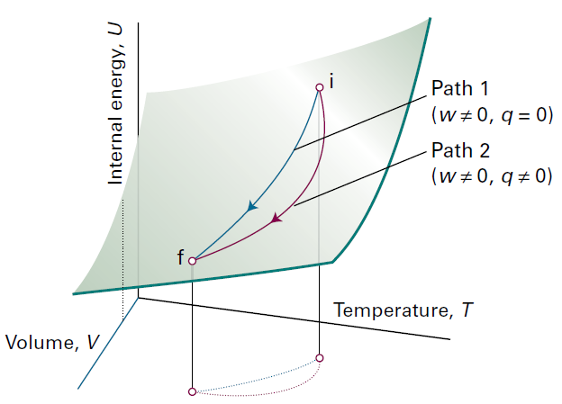
全微分 $dU$ 是一个无穷小量，**状态函数**，当其被积分时，所得结果与始态和终态之间的途径无关。
非全微分 ${\delta}q,{\delta}w$ s 是一个无穷小量，是一个无穷小量，**路径函数**，当其被积分时，所得结果与始态和终态之间的途径有关。

### 内能分析
$$C_{V}=\left(\frac{\partial V}{\partial T}\right)_{V}，U=f(T,V)$$
$$U=U (p, T)=U (p, V)=U (V, T)$$
由恒容热容的定义可知，内能是体积和温度的函数，当两个变量变化时，内能的变化为：
$$\mathrm{d}U=\left(\frac{\partial U}{\partial V}\right)_T\mathrm{d}V+\left(\frac{\partial U}{\partial T}\right)_V\mathrm{d}T$$
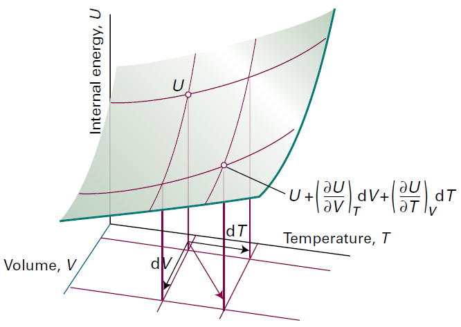

$$\begin{aligned}dU &=\left(\frac{\partial U}{\partial }\right)_TdV+\left(\frac{\partial U}{\partial T}\right)_VdT\\&
=C_VdT+\left(\frac{\partial U}{\partial V}\right)_VdV\\&
=C_VdT+{\pi}_TdV\end{aligned}$$

在多数情况下，偏导数都具有直接的物理意义，只有当其没有物理意义时，热力学才变得抽象和难懂。
${\pi}_T$ 具有与压力相同的量纲，但它是由样品内分子之间的相互作用而产生的，故称为**内压** (internal pressure): 
$$\pi_T=\left(\frac{\partial U}{\partial V}\right)_T$$
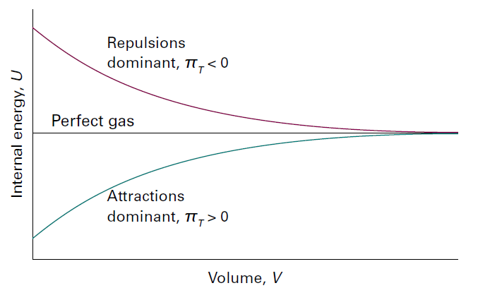

$\pi_T=0$ (即内能与样品所占据的体积无关) 可以被作为完美气体的定义，因为其暗示了状态方程 $pV\propto T$。从分子层面看，当分子之间没有相互作用时，内能与它们之间的距离无关，因此也就与样品的体积无关，则 $\pi_T=0$。如果用含 $a$ 的范德华方程描述气体，系数 $a$ 对应于占优势的吸引力，那么体积的增加会增加分子的平均距离并因此使内能增大。在该情况下，可以预期 $\pi_T>0$ ，并证明为 $\pi_{T}=na/V^{2}$。

物质的**膨胀系数**$\alpha$
$$\alpha=\frac{1}{V}\left(\frac{\partial V}{\partial T}\right)_p$$
对于完美气体，
$$\alpha=\frac{1}{V}\left(\frac{\partial V}{\partial T}\right)_{p}=\frac{1}{V}\left[\frac{\partial(nRT/p)}{\partial T}\right]_{p}=\frac{1}{V}\times\frac{nR}{p}=\frac{nR}{pV}=\frac{nR}{nRT}=\frac{1}{T}$$

**等温压缩系数** $\kappa_{T}$
$$\kappa_T=-\frac{1}{V}\left(\frac{\partial V}{\partial p}\right)_T$$
对于完美气体，
$$\kappa_T=-\frac{1}{V}\left(\frac{\partial V}{\partial p}\right)_T
=-\frac{1}{V}\left(\frac{\partial {(\frac{nRT}{p}})}{\partial p}\right)_T
=\frac{1}{V}\frac{nRT}{p^2}
=\frac{P}{p^2}
=\frac{1}{p}$$

对内能公式进一步进行分析
$$\left(\frac{\partial U}{\partial T}\right)_p=\pi_T\left(\frac{\partial V}{\partial T}\right)_p+C_V$$

**对于完美气体**，$\pi_T=0$
$$\left(\frac{\partial U}{\partial T}\right)_p=C_V=\left(\frac{\partial U}{\partial T}\right)_V$$
完美气体恒压热容和恒容热容相等
根据定义，H=U+pV=U+nRT
$$C_p-C_V=\left(\frac{\partial H}{\partial T}\right)_p-\left(\frac{\partial U}{\partial T}\right)_V$$
$$C_p-C_V=\left[\frac{\partial(U+nRT)}{\partial T}\right]_p-\left(\frac{\partial U}{\partial T}\right)_p=nR$$$\\ C_{P}=C_{V}+nR$
根据热力学公式，对于**任意物质**，可以证明：
$$C_p-C_V=\frac{\alpha^2TV}{\kappa_T}$$
当 $\alpha=1/T$ 及 $\kappa_T=1/p$ 完美气体时，
$$C_p-C_V=nR$$
### 焓变分析
对于焓H=U+pV
$$\mathrm{d}H=\left(\frac{\partial H}{\partial p}\right)_T\mathrm{d}p+\left(\frac{\partial H}{\partial T}\right)_p\mathrm{d}T$$
如果是等焓过程 $dH=0$
$$\left(\frac{\partial H}{\partial p}\right)_T\mathrm{d}p=-C_p\mathrm{d}T$$
$$\left(\frac{\partial H}{\partial p}\right)_T=-C_p\left(\frac{\partial T}{\partial p}\right)_H=-C_p\mu$$
式中 $µ$ 为焦耳－汤姆孙系数 $\mu=\left(\frac{\partial T}{\partial p}\right)_H$

由此得到： $$\mathrm{d}H=-\mu C_{p}\mathrm{d}p+C_{p}\mathrm{d}T$$

### 焦耳-汤姆孙效应

焦耳-汤姆孙系数的分析是与气体液化相关的技术问题的核心。为了测量该系数，必须测量等焓过程中温度变化与压力变化的比值 $\Delta T/\Delta p$。James Joule 和William Thomson提出了一种巧妙的方法，施加了所需等焓约束，这样膨胀就是等焓(isoenthalpic) 膨胀。他们让气体通过多孔屏障从某一恒定的压力膨胀到另一压力，并监测膨胀过程中产生的温差。他们观察到的这种因等焓膨胀而产生的温度变化称为焦耳-汤姆孙效应 (Joule-Thomson effect)。

“林德制冷机”利用焦耳-汤姆孙效应来液化气体。高压气体通过节流阀膨胀, 气体冷却并作为进气而循环。这些气体先被冷却, 紧接着又通过膨胀进一步得到冷却。经多次循环后的气体不断冷却以至气体系统温度 $T$ 低于临界温度 $T_r$ 时，其可以凝结成液体。
#### 焦耳-汤姆孙实验
焦耳-汤姆孙实验中，气体所有的变化都是绝热的 $q=0$ ，等焓的 $\Delta H=0$。

对于完美气体，$\mu=0;$ 因此，经焦耳-汤姆孙膨胀，完美气体的温度不变。该特征清楚地表明分子间作用力在决定焦耳-汤姆孙效应大小上的作用。

实际气体具有非零焦耳-汤姆孙系数。随着气体的性质、压力、分子间吸引力和排斥力的相对大小及温度的不同，焦耳-汤姆孙系数的符号可正可负。正号表示当 $dp$ 为负时 $dT$ 亦为负。此时，气体膨胀时冷却。然而，对于真实气体。即使其压力较小，甚至其状态方程接近完美气体，其焦耳-汤姆孙系数也并非一定接近于零。
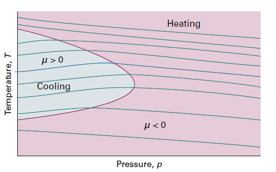
在某温度下表现出加热效应 ($\mu<0$) 的气体，当温度低于其上转化温度 ( inversion temperature)
时，则表现出致冷效应 ($\mu>0$)。气体通常有两个典型的**转化温度**。在转化温度范围内，气体焦耳-汤姆孙系数 $\mu>0$ 表现出致冷效应，可以作为制冷剂。
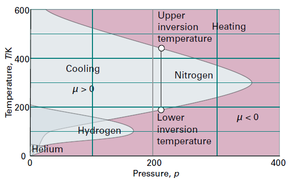
#### 分子解释

**气体动理论模型**和**均分定理**都表明，气体分子的平均动能与温度成正比。因此，降低分子的平均
速率等同于冷却气体。如果分子的速率降低到相邻分子通过分子间吸引力可被相互捕捉住的程度，
则冷却的气体将凝结成液体。

减小气体分子速率效应与球被抛向空中时所看到的情形类似；当球上升时，为了应对地球重力作用而减速，其动能转化为势能。正如之前讨论的，实际气体分子相互吸引 (吸引力不是重力，但效果相同)。

因此，如果分子彼此膨胀远离，就像从行星上升的球一样，它们将减速。从而气体系统势能增加动能减小，动能与温度正相关，简单地使气体膨胀，可以增加分子的平均间距，从而可以很容易地使分子彼此分离。**因此，为了冷却气体，必须在不允许任何能量以热的形式从外部进入的情况下进行膨胀**。当气体膨胀时，分子克服与相邻分子的吸引力而分开并充满整个体积。因为当分子间距离变得更大时，部分动能必将转化为势能，所以当分离程度增加时，分子的移动速率更慢，温度下降。

对于处在吸引作用占优势 $Z<1$（其中 $Z$ 为定义的压缩因子，$Z=V_\mathrm{m}/V_\mathrm{m}^\circ$）条件下的实际气体，观察到了对应于 $\mu>0$ 的致冷效应，这是因为分子必须反抗吸引力而分开，以使其运动更慢。对于处在以排斥作用为主的条件下的分子 $Z>1$, 焦耳-汤姆孙效应使气体变暖，观察到了对应于 $\mu<0$ 的加热效应。
### 概念清单
1.$dU$ 是全微分，但 $dw$ 和 $dq$ 不是。
2.内能的变化可以用温度和体积的变化来表示。
3.内压是等温时内能随体积的变化。
4.焦耳实验表明完美气体的内压为零。
5.内能随着压力和温度的变化可用内压和热容来表示，从而得到热容之间关系的一般式。
6.**焦耳-汤姆孙效应**是气体进行等焓绝热膨胀时温度的变化。
## 第 9 讲-绝热过程

当气体 (在一隔热容器中) 绝热膨胀时，温度下降。由于对外做功，又没有热进入系统 $q=0$ ，内能会下降，因此温度也会下降。从分子层面看，分子的动能随着做功而减小，因而其平均速率降低，因此温度也会下降。

### 绝热可逆温度变化

当温度由 $T_\mathrm{i}$ 变为 $T_\mathrm{f}$，体积由 $V_\mathrm{i}$ 变为 $V_\mathrm{f}$ 时，完美气体的内能变化可表示为两步之和。
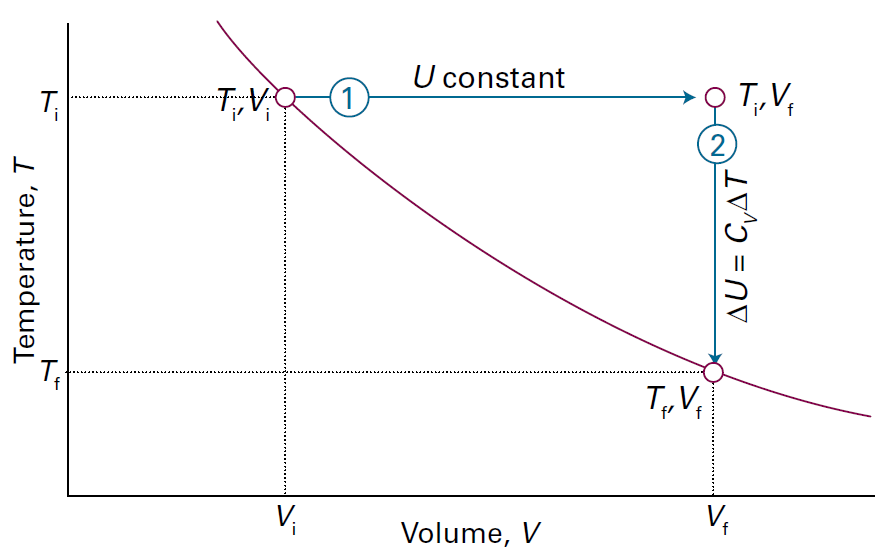
在第一步，只有体积发生变化，而温度恒定在初始值不变。但是，由于完美气体的内能与体积无关，故内能的总变化完全来自第二步，即等容下温度的变化。假设热容与温度无关，则内能的变化为：
$$\Delta U=(\begin{array}{c}T_\mathrm{F}-T_\mathrm{i}\end{array})C_V=C_V\Delta T$$
因此，绝热过程中完美气体所做功为：
$$w_{\mathrm{ad}}=C_{\nu}\Delta T$$
也就是说，完美气体在绝热膨胀过程中所做的功与始态和终态之间的温度差成正比。这正是分子理论所预期的结果，这是因为平均动能与 $T$ 成正比，所以仅由温度引起的内能变化也与 $\Delta T$ 成正比。根据以上讨论，可以计算完美气体经绝热可逆膨胀 (在隔热容器中可逆膨胀) 时的温度变化。

气体可逆膨胀 $dV$ 所做的功为 $dw=-pdV$，可以得到
$$
\begin{aligned}
C_V\mathrm{d}T=-p\mathrm{d}V
\end{aligned}
$$

$$
\begin{aligned}
C_V\mathrm{d}T=-p\mathrm{d}V\\
\\
\frac{C_V\mathrm{d}T}{T}=-\frac{nR\mathrm{d}V}{V}
\end{aligned}
$$

$$
\begin{aligned}
C_V\ln\frac{T_\mathrm{f}}{T_\mathrm{i}}=-nR\ln\frac{V_\mathrm{f}}{V_\mathrm{i}}
\end{aligned}
$$

$$
\begin{aligned}
T_{\mathrm{f}}=T_{\mathrm{i}}\left(\frac{V_{\mathrm{i}}}{V_{\mathrm{f}}}\right)^{1/c}\quad,
c=C_{V,\mathrm{m}}/R
\end{aligned}
$$
温度变化可以归纳为：$VT^c=\text{常数}$

可以推导知道：温度的变化与气体物质的量无关，但功与物质的量有关。
### 绝热可逆压力变化

完美气体压力推导：
$$
\begin{aligned}
pV=nTR
\end{aligned}
$$
$$
\begin{aligned}
\frac{p_\mathrm{i}}{p_\mathrm{f}}\left(\frac{V_\mathrm{i}}{V_\mathrm{f}}\right)^\gamma=1，\frac{C_{p,m}}{C_{V,m}}=\gamma
\end{aligned}
$$
温度变化可以归纳为：${pV}^\gamma=\text{常数}$
对于单原子完美气体，$C_{V,\mathrm{m}}=3R/2$ (专题 2 A), $C_{p, \mathrm{~m}}= 5R/ 2$ ( 根据 $C_{p,m}-C_{V,m}=R$), 因此 $\gamma=5/3$。对于非线性多原子气体分子 (有平动也有转动；常温下振动贡献很小), $C_{V,\mathrm{m}}=3R,C_{p,\mathrm{m}}=4R$, 所以 $\gamma=4/3$。绝热变化过程中的压力随体积变化的曲线称为绝热线(adiabats),。因为 $\gamma>1$, 对应于等温线( $p\propto1/V$)，绝热线下降幅度($p\propto1/V^{\gamma})$ 更陡。产生这种差异的物理原因是，等温膨胀时，能量以热的形式进入系统以维持该温度，其结果是压力不会像绝热膨胀那样快速下降。
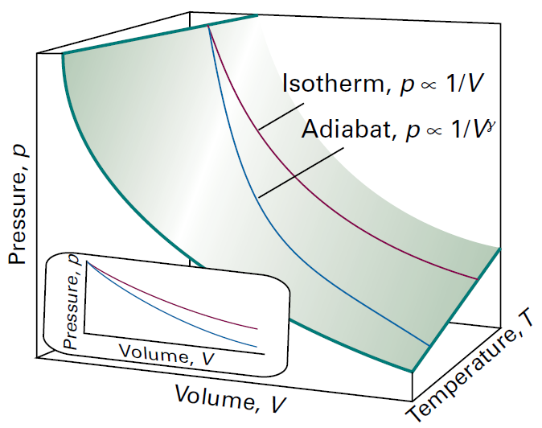

下面讨论：
等压线： $\gamma=0$ 时，$p=Cosntant$;
等容线： $\gamma=\infty$ 时，$V=Cosntant$;
等温线： $\gamma=1$ 时，$pV=Cosntant$;
绝热线：$${pV}^\gamma=\text{常数}$$
### 概念清单
1.当气体绝热膨胀对外做功时,其温度下降。
2.**绝热线**表示绝热过程中压力是如何随体积变化的。
