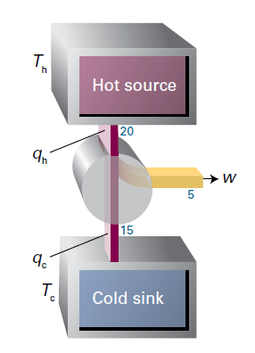

# 第3章热力学第二定律和第三定律
## 第 10 讲-熵

和内能（U），焓（H）一样，熵 $S$ 也是**状态函数**。

给定温度下某物质的**标准状态**( standard state) 就是 1 bar 压力下的纯态。
### 自发过程

自发过程是什么？
人往高处走，水往低处流。

自发过程是不可逆的-irreversible

Entropy-熵
熵几乎是在所有化学应用中都要遇到的热力学基本概念：熵可以解释为什么某些物理变化和化学反应可以**自发进行**，而另一些变化却不能自发进行。

自发变化方向是由什么决定的？能量趋于减小的方向不一定就是自发方向，因为热力学第一定律告诉我们，无论发生什么过程，宇宙中总能量是保持不变的。事实证明，**某一过程的变化方向是由能量和物质分布状况决定的**，热力学第二定律准确地表达了这个思想，并通过引入熵，使该思想得到定量表达。

### 热力学第二定律

Kelvin‘s Statement-1824
不可能制造出从单一热源吸热、使之全部转化为功而不留下其他任何变化的热机。

Clausius‘ Statement-1850
热量不会自发地从低温物体流向高温物体。
### 熵

熵可以作为能量与物质分散程度的一种度量，也可以作为对系统无序程度的衡量，熵减无序化，熵增有序化。

为了定量描述**热力学第二定律**，有两种方法对熵进行定义与计算。
#### 热力学定义

微观单原子熵：
$$
\begin{aligned}
\mathrm{d}S=\frac{\mathrm{d}q_\mathrm{rev}}{T}
\end{aligned}
$$
宏观可测的熵变为：
$$
\begin{aligned}
\Delta S=\int_{\mathrm{i}}^{\mathrm{f}}\frac{\mathrm{d}q_{\mathrm{rev}}}{T}
\end{aligned}
$$

#### 统计学定义
原子和分子分布在不同能级上，且符合玻耳兹曼分布。有了这样的思想，就可以基于分子行为来解释热力学第二定律，并可从统计热力学的角度定义熵。由统计热力学可知，温度升高，分子会占据更高的能级。玻耳兹曼指出，熵与分子在可占据能级上的分布状况有关，两者之间的关系可表示为 
$$
\begin{aligned}
S=k\ln W
\end{aligned}
$$
上式称为**玻耳兹曼公式**

和内能，焓一样，熵 $S$ 也是**状态函数**。

$$
\begin{aligned}
\oint dS=\oint \frac{\mathrm{d}q_\mathrm{rev}}{T}=0
\end{aligned}
$$

#### 热力学第二定律的数学表达
首先, 系统及其环境被看作一个隔离系统（有可能是一个十分巨大的隔离系统），有时候，这个大隔离系统实际指的就是“**整个宇宙**”。在这个大隔离系统内部，能量可以在实际被研究系统和其环境之间转移，但能量不会从大隔离系统中溢出。这种情况下，就可以采用一个新状态函数——熵 $( entropy) S$ 来表述热力学第二定律：

**隔离系统**中自发变化时熵总是增加的：$\Delta S_{tot}>0$

这个不等式中，$S_\mathrm{tot}$ 是大隔离系统的总熵。也就是说，如果 $S$ 是被研究系统的熵，$S_\mathrm{sur}$ 是被研究系统对应**环境的熵**，则 $S_\mathrm{tot}=S+S_\mathrm{sur}$ 在应用热力学第二定律处理问题时，有一点一定要牢记，那就是这个定律关注的是大隔离系统 (宇宙) 的总熵，而不是只关注被研究系统的熵。

总而言之，热力学第一定律通过使用内能这个状态函数，告诉我们什么样的变化过程是允许的（**可行性**）；热力学第二定律则通过使用熵这个状态函数，告诉我们在这些允许的变化过程中，又有哪些变化过程是自发进行的（**方向性**）。

##### 克劳修斯不等式
$$
\begin{aligned}
dS\geq\frac{\delta q}{T}
\end{aligned}
$$
证明：
$$
\begin{aligned}
\begin{aligned}dV&=\delta q+\delta w\\&=\delta q_{rev}+\delta w_{rev}=C\end{aligned}
\end{aligned}
$$
实际过程中，$\delta w_{rev}\geq\delta w$
因此，$q_{rev}\geq{q}$
$$
\begin{aligned}
\mathrm{d}S=\frac{\mathrm{d}q_\mathrm{rev}}{T}\geq\frac{\delta q}{T}
\end{aligned}
$$
所以，克劳修斯不等式确实是热力学第二定律的一个数学化形式，反映了实际过程不可逆的特性。
### 卡诺循环

Carnot Cycle

#### 过程分析
循环由四个**可逆过程**构成。
**完美气体**参与此循环

**Stage 1**：等温膨胀。在这个过程中气体与高温热源 $T_{h}$ 接触，从高温热源中吸收热量，从 A 状态等温可逆膨胀到 B 状态。等温可逆膨胀过程中系统
吸收热量 $q_h$ 为：
$$
\begin{aligned}
q_h=nRT_h{ln\frac{V_B}{V_A}}
\end{aligned}
$$
系统熵变 $S$ 为：
$$
\begin{aligned}
S=\frac{q_{h}}{T_{h}}
\end{aligned}
$$
**Stage 2**：绝热膨胀。在这个过程中气体与高温热源 $T_{h}$ 脱离，从 B 状态绝热可逆膨胀到 C 状态，过程中系统与环境没有热量传递 $q=0$，熵变为零 $S=0$ 。绝热可逆膨胀过程中系统从高温 $T_{h}$ 降低到低温 $T_{c}$ 。根据绝热过程中 $VT^c=\text{常数}$ 可以得到下面关系式：
$$
\begin{aligned}
V_{B}T_{h}^c=V_{C}T_{c}^c
\end{aligned}
$$
**Stage 3**：等温压缩。在这个过程中气体与低温热源 $T_{c}$ 接触，向低温热源中放出热量，从 C 状态等温可逆压缩到 D 状态，等温可逆压缩过程中系统
释放热量 $q_c$ 为：
$$
\begin{aligned}
q_c=nRT_c{ln\frac{V_D}{V_C}}
\end{aligned}
$$
系统熵变 $S$ 为：
$$
\begin{aligned}
S=\frac{q_{c}}{T_{c}}
\end{aligned}
$$
**Stage 4**：绝热压缩。在这个过程中气体与低温热源 $T_{c}$ 脱离，从 D 状态绝热可逆膨胀到 A 状态，过程中系统与环境没有热量传递 $q=0$，熵变为零 $S=0$ ，绝热可逆压缩过程中系统从低温 $T_{c}$ 升高到低温 $T_{h}$ 。根据绝热过程中 $VT^c=\text{常数}$ 可以得到下面关系式：
$$
\begin{aligned}
V_{D}T_{c}^c=V_{A}T_{h}^c
\end{aligned}
$$
根据上述过程中 $q_{h}$ 与 $q_{c}$ 的关系式进而得到：
$$
\begin{aligned}
\frac{q_{h}}{q_{c}}=-\frac{T_{h}}{T_c}
\end{aligned}
$$
$$
\begin{aligned}
\frac{q_\mathrm{h}}{T_\mathrm{h}}+\frac{q_\mathrm{c}}{T_\mathrm{c}}=0
\end{aligned}
$$
此即证明卡诺循环中完美气体熵变为 0

可逆过程中，系统恢复原来状态，在等温压缩和绝热压缩过程中系统对环境作负功。
#### 热机效率
热机：把一部分热从热源搬运到冷源，过程中把其中一部分作为功输出。
**热机效率**定义为
$$
\begin{aligned}
\eta=\frac{\text{完成的功}}{\text{从高温热源吸取的热量}}=\frac{|w|}{|q_\mathrm{h}|}
\end{aligned}
$$

热机做功 $|w|$ 为从高温热源吸收的热量与释放到低温热量的差值

$$
\begin{aligned}
\eta=\frac{\left|q_\mathrm{h}\right|-\left|q_\mathrm{c}\right|}{\left|q_\mathrm{h}\right|}=1-\frac{\left|q_\mathrm{c}\right|}{\left|q_\mathrm{h}\right|}
\end{aligned}
$$
又
$$
\begin{aligned}
\frac{q_{h}}{q_{c}}=-\frac{T_{h}}{T_c}
\end{aligned}
$$
因此

$$
\begin{aligned}
\eta=1-\frac{T_\mathrm{c}}{T_\mathrm{h}}
\end{aligned}
$$
#### 效率证明

如何证明可逆热机效率最高？

热机把一部分热从热源搬运到冷源，过程中把其中一部分作为功输出。如果逆开这个热机，它就是一个制冷机，是在功的输入下，把一部分冷源搬运到热源。可逆热机的概念保证了，同一部热机，正开和逆开的情况下，效率是相等的。

首先第一步，可以证明**在相同的冷热源下**，**所有的可逆热机效率相等**。这个思路很简单，用一个可逆热机 A 做功，驱动另一个可逆制冷机 B，使得 A 做功过程中排入冷源的热量被搬运回热源。如果它们的效率不等，那么就会产生不平衡，导致产生从单一热源取热全部用于做功的情况出现。这就违背了热力学第二定律。

假设有个卡诺热机（称为 A）效率为40%，它在一个循环中从高温热源吸热100J，向低温热源放热60J，对外做功40J。卡诺循环是可逆循环，必然存在一个卡诺制冷机（称为 B），它在一个循环中向高温热源放热100J，从低温热源吸热60J，需要外界对其做功40J。若卡诺定理不成立，存在一个热机（称为 A‘ )效率为41%，它在一个循环中从高温热源吸热100J，向低温热源放热59J，对外做功41J。现在将A和B放在一起共同工作一个循环，其结果是从低温热源吸热1J，对外做功1J，而不引起其他变化。该结果违背了热力学第二定律。

然后第二步，证明可逆热机效率最高。这个就是用一个可逆热机和不可逆热机联动的情况下证明，证明过程也很简单。都是用反证法，如果不如此，则会出现热力学第二定律的卡尔文表述被违背的情况。这和它是不是卡诺热机没有关系。关键在于，你需要理解可逆过程是个什么东西。
### 概念清单

1.熵是自发变化的一个标志：宇宙的熵在自发过程中增加。
2.熵变是根据可逆热交换进行定义的。
3.**玻耳兹曼公式**根据总能量不变的情况下分子在不同能级中排列的方式数来定义熵。
4.**卡诺循环**被用来证明熵是状态函数。
5.**热机效率**是热力学温标定义的基础，也让热力学温标成为实用温标，即开尔文温标。
6.**克劳修斯不等式**表明隔离系统的熵在自发变化过程中增加，因此克劳修斯的定义与热力学第二定律是一致的。
7.自发过程是不可逆过程，熵变为零的过程处于平衡状态。

## 第 11 讲-熵变的计算

熵变作为物质无序度的度量单位，熵增原理是自然界中的普遍规律，即在孤立系统中，熵总是趋向增加。这意味着，在没有外部干扰的情况下，系统会自然地向更加无序的状态发展。

温度熵增，体积熵增，压力熵增

###  等温膨胀熵

完美气体等温膨胀

对于完美气体，等温膨胀过程做功在之前已经讨论，
$$
\begin{aligned}
w=-nRT\int_{V_\mathrm{i}}^{V_\mathrm{f}}\frac{\mathrm{d}V}{V}=-nRT\ln\frac{V_\mathrm{f}}{V_\mathrm{i}}
\end{aligned}
$$
#### 等温可逆膨胀
此时对于完美气体来说，
$$
\begin{aligned}
\Delta U=0,q=-w=nRT\ln\frac{V_\mathrm{f}}{V_\mathrm{i}}
\end{aligned}
$$
$$
\begin{aligned}
\mathrm{d}S=\frac{\mathrm{d}q_\mathrm{rev}}{T}
\end{aligned}
$$
$$
\begin{aligned}
\Delta S=\frac{1}{T}\int_\mathrm{i}^\mathrm{f}\mathrm{d}q_\mathrm{rev}=\frac{q_\mathrm{rev}}{T}=nR\ln\frac{V_\mathrm{f}}{V_\mathrm{i}}
\end{aligned}
$$
由于 S 是状态函数, 所以系统的 $\Delta S$ 值与始态和终态之间的变化途径无关。因此, 无论状态的实际变化过程是可逆的还是不可逆的，这个表达式都是适用的。因为目标是个状态函数，与路径的选择（可逆或者不可逆）无关。

考虑到隔离系统总熵变 $S_\mathrm{tot}=S+S_\mathrm{sur}$，$\Delta S_{tot}=0$

因此
环境熵变 $\Delta S_\mathrm{sur}=-nR\ln\frac{V_\mathrm{f}}{V_\mathrm{i}}$,
系统（完美气体）熵变 $\Delta S=nR\ln\frac{V_\mathrm{f}}{V_\mathrm{i}}$
隔离系统总熵变 $\Delta S_{tot}=0$
#### 等温不可逆膨胀

**自由膨胀**： $p_{\mathrm{ex}=0}$ 条件下，系统对环境不做功 $w=0$。
**等温**：温度 T=0，此时 $\Delta U=0$，因此 $q=0$，环境 $q_{sur}=0,\Delta S_\mathrm{sur}=0$

因此
环境熵变 $\Delta S_\mathrm{sur}=0$
系统熵变 $\Delta S=nR\ln\frac{V_\mathrm{f}}{V_\mathrm{i}}$
隔离系统总熵变$\Delta S_{tot}=nR\ln\frac{V_\mathrm{f}}{V_\mathrm{i}}$
### 相变熵

相变可视为等温等压过程，$T,p=const$

根据之前的讨论：**定压条件下**焓变是系统与环境间交换的热 $H=q$

因此
$$
\begin{aligned}
\Delta_\mathrm{trs}S=\frac{\Delta_\mathrm{trs}H}{T_\mathrm{trs}}
\end{aligned}
$$
如果相变过程放热 ( $\Delta_\mathrm{trs}H<0$, 如凝固或冷凝过程)，则系统的熵变为负值，这与相变过程中分子有序程度变化趋势是一致的，固体分子的有序程度比液体高，液体分子的有序性程度比气体高。但在这种情况下，由于环境是吸热的，环境的熵变为正，且由于在相变温度下两相处于平衡状态，**故总熵变为零**。如果相变过程是吸热的 $(\Delta_{\mathrm{trs}}H>0)$ 如熔化和气化，则系统的熵变为正，这与系统中物质分子变得更加分散的情况是一致的。与此同时，环境中熵减少，环境中熵的减少量与系统熵的增加量相同，过程中**总熵变仍是零**（总熵变为零是指把总系统当做**隔离系统**）。

#### 特鲁顿规则
下面列出一些相变过程中熵变的实验测量数据，这些数据显示出一个有趣现象，即多种不同液体都有大致相同的***标准蒸发熵*** (约 $85-88 \mathrm{J}\cdot\mathrm{K}^{-1}\cdot\mathrm{mol}^{-1}):$ 

这种经验规律称为特鲁顿规则 ( Trouton's rule)。特鲁顿规则可以进行如下解释，即不同液体蒸发变成气体时，体积变化量大致都差不多，因此可以预计，所有液体都具有大致相同的标准蒸发熵。

**特鲁顿规则**可以进行如下解释，即不同**液体蒸发成气体**时，体积变化量大致都差不多，因此可以预计，**所有液体都具有大致相同的标准蒸发熵**。

有些液体相对特鲁顿规则会出现**显著偏差**，这是由于这些液体的分子之间存在强烈的相互作用，从而使液体分子的聚集呈现出部分有序性，结果导致这些液体变成蒸气时，与完全无序液体的汽化过程相比，无序程度的变化量就会更大一些。

水就是一个这样的例子，**水**的蒸发熵较大，表明液态水中存在氢键结构，**氢键**倾向于将液态水分子有序地聚集在一起，使液态水分子与某些物质，如与液态硫化氢中的分子 (其中没有氢键) 相比，无序性就更低一些。

另一种液体**甲烷**的蒸发熵却是异常低，导致这一结果的部分原因是甲烷气体本身的熵略低 (298 K 时为 186  $\mathrm{J}·\mathrm{K}^{-1}\cdot\mathrm{mol}^{-1}$, 而在相同条件下 $\mathrm{N}_2$ 的熵为 192 $\mathrm{J}·\mathrm{K}^{-1}\cdot\mathrm{mol}^{-1}$)。后面将会看到，对于质量小和转动惯量小的分子（如 $CH_4$），室温下可拥有的平动和转动状态，与质量大和转动惯量大的分子（如 $\mathrm{N}_2$）相比会更少一些，因而它们的摩尔蒸发熵也就略低一些。
### 加热膨胀熵

$$
\begin{aligned}
S(T_\mathrm{f})=S(T_\mathrm{i})+\int_{T_\mathrm{i}}^{T_\mathrm{f}}\frac{\mathrm{d}q_\mathrm{rev}}{T}
\end{aligned}
$$
#### 等压膨胀
等压变温过程中，$\mathrm{d}q_{\mathrm{rev}}=\mathrm{d}H$，$\mathrm{d}H=C_{p}\mathrm{d}T$，所以
$$
\begin{aligned}
S(T_\mathrm{f})=S(T_\mathrm{i})+C_p\int_{T_\mathrm{i}}^{T_\mathrm{f}}\frac{\mathrm{d}T}{T}=S(T_\mathrm{i})+C_p\ln\frac{T_\mathrm{f}}{T_\mathrm{i}}
\end{aligned}
$$
#### 等容膨胀
等容变温过程中，$\mathrm{d}q_{\mathrm{rev}}=\mathrm{d}U$, $\mathrm{d}U=C_{V}\mathrm{d}T$
$$
\begin{aligned}
S(T_\mathrm{f})=S(T_\mathrm{i})+C_V\int_{T_\mathrm{i}}^{T_\mathrm{f}}\frac{\mathrm{d}T}{T}=S(T_\mathrm{i})+C_V\ln\frac{T_\mathrm{f}}{T_\mathrm{i}}
\end{aligned}
$$
### 概念清单

1.等温膨胀时完美气体的熵增加。
2.相变温度下，物质相变过程的熵变可根据相变焓来计算。
3.物质升温过程的熵变可根据物质的热容计算。

## 第 12 讲-规定熵

$$
\begin{aligned}S_{\mathrm{m}}(T)&=S_{\mathrm{m}}(0)+\int_{0}^{T_{\mathrm{f}}}\frac{C_{p,\mathrm{m}}(\mathrm{s},T^{\prime})}{T^{\prime}}\mathrm{d}T^{\prime}+\frac{\Delta_{\mathrm{fus}}H}{T_{\mathrm{f}}}\\&+\int_{T_{\mathrm{f}}}^{T_{\mathrm{b}}}\frac{C_{p,\mathrm{m}}(1,T^{\prime})}{T^{\prime}}\mathrm{d}T^{\prime}+\frac{\Delta_{\mathrm{vap}}H}{T_{\mathrm{b}}}\\&+\int_{T_{\mathrm{b}}}^{T}\frac{C_{p,\mathrm{m}}(\mathrm{g},T^{\prime})}{T^{\prime}}\mathrm{d}T^{\prime}\end{aligned}
$$

当测量 $T=0$ 附近的熵时会遇到测量困难的问题，此时可以假设非金属固体的热容与 $T^3$ 成正比，即德拜外推，假设 $C_{p,\mathfrak{m}}(T)=aT^3$。

### 热力学第三定律
#### 能斯特热定理
温度 $T$ 为零时，热运动的全部能量都已耗尽。完美晶体中，所有原子或离子的排列方式都是均匀和规则的。物质粒子定域化，热运动停止，表明这时候物质的熵为零。这一结论与熵的微观分子解释结果是一致的，因为当粒子全部处于基态时，粒子也就只有一种排列方式，这就是 $T$ 等于零的情况。$T$ 等于零时，$W$ 等于 1，根据 $S=k\ln W$, 就得到S等于零。

能斯特热定理 (Nernst heat theorem) 是对一系列实验结果的总结, 这些实验结果与等于零时规则排列分子的熵为零的观点是一致的: 若所有物质完美有序，当温度趋近零时，任何物理或化学变化过程的熵变都为零，即 $T\to0,\Delta S\to0$。

根据能斯特热定理，如果在温度为零时单质的完美晶体的熵值为零，则所有完美晶体化合物在温度为零时的熵也为零 (因为 $T=0$ 时，与在该温度的所有转变熵为零的情况一样，化合物的生成熵亦为零)。这可总结为热力学第三定律 (third law of thermodynamics )：

在 $T=0$ 时，所有完美晶体物质的熵值都为零。

#### 标准反应熵

**与之前讨论焓的情况一样**，无法单独制备只有阳离子而没有阴离子的溶液，溶液中离子的标准摩尔熵的确定就要选择离子熵的零标度。按照惯例，规定所有温度下水中 $H^{+}$ 的标准摩尔熵均为零：
$$
\begin{aligned}
S^\Theta(\mathrm{H}^+,\mathrm{aq})=0
\end{aligned}
$$
根据这个规定，资源部分中的表列出了溶液中一些离子的标准熵（溶液中的离子熵实际上是偏摩尔熵，因为它们的数值大小还包含了离子周围的溶剂分子的排列情况）。因为水中离子的熵值是与水中氢离子的熵值进行比较的结果，所以它们可以是正值，也可以是负值。正熵意味着离子在水中的摩尔熵比 $H^{+}$ 的摩尔熵更高，负熵表示离子在水中的摩尔熵比 $H^+$ 的摩尔熵更低。

不难发现，不同离子的熵值不同，因为离子的熵值与溶液中离子周围水分子有序程度高低有关。体积小电荷高的离子，可以使其周围水分子形成局部的有序结构，与体积大电荷低的一价离子相比，含有体积小电荷高离子的溶液，其无序性的下降程度更大。对于水中的质子来说，其由热力学第三定律确定的标准摩尔熵的绝对值，可以通过由质子诱导形成的结构模型进行估算，估算的数值大约为 $-21 J·\mathrm{K}^{-1}\cdot\mathrm{mol}^{-1}$。结果为负值，表示质子在溶液中可以使溶剂分子有序化。

### 概念清单
1.通过测量从低温到目标温度范围内物质的热容，并结合该温度范围内的所有相变，可以用量热方式得到物质的熵值。
2.**德拜外推** (或称德拜 $T^3$ 定律) 用于估算趋近 $T=0$ 时非金属固体物质的热容。
3.**能斯特热定理**指出：如果所有物质都完美有序，则任何物理或化学变化过程中的熵变在温度趋近零时都趋近于零，即当 $T\to0,\Delta S\to0$。
4.**热力学第三定律**指出：在 $T=0$ 时，所有完美晶体物质的熵都为零。
5.**固体的残余熵**是由于在 $T=0$ 时存在的无序性所引起的熵。
6.第三定律熵是基于 $S (0)=0$ 得到的熵。
7.溶液中离子的标准熵基于所有温度下设定 $S^{\Theta}(H^{+}$, a $q)=0$。
8.标准反应熵 $\Delta_{\mathrm{r}}S^{\oplus}$ 是处于标准状态的纯产物和纯反应物摩尔熵的差值。

## 第 13 讲-亥姆霍兹能和吉布斯能

#### 克劳修斯不等式
$$
\begin{aligned}
dS\geq\frac{\delta q}{T}
\end{aligned}
$$
证明：
$$
\begin{aligned}
\begin{aligned}
dU
&=\delta q+\delta w\\
&=\delta q_{rev}+\delta w_{rev}=C\end{aligned}
\end{aligned}
$$
实际过程中，$\delta w_{rev}\geq\delta w$
因此，$q_{rev}\geq{q}$
$$
\begin{aligned}
\mathrm{d}S=\frac{\mathrm{d}q_\mathrm{rev}}{T}&\geq\frac{\delta q}{T}\\
\delta \mathrm{q}-\mathrm{TdS}&\le{0}
\end{aligned}
$$

### 自发性判据
对于过程中进行的条件（等压或等容），克劳修斯不等式可以改写成两种形式：
等压条件下 $V=const$，$dq_{V}=dU$, 此时 $dU-\mathrm{TdS}\le{0}$
等容条件下 $p=const$，$dq_{p}=dH$，此时 $dH-\mathrm{TdS}\le{0}$

亥姆霍兹函数（helmholtz），$A=U-TS$，**状态函数**
吉布斯函数（Gibbs），$G=H-TS$，**状态函数**

等温条件下：
$$
\begin{aligned}
&\mathrm{d}A=\mathrm{d}U-T\mathrm{d}S\\\\
&\mathrm{d}G=\mathrm{d}H-T\mathrm{d}S
\end{aligned}
$$
自发变化判据：
等温等容条件下：
$$
\begin{aligned}
\mathrm{d}A_{T,V}\leq0
\end{aligned}
$$
等温等压条件下：
$$
\begin{aligned}
\mathrm{d}G_{T,p}\leq0
\end{aligned}
$$
**孤立系统不可逆过程是自发的**
过程的自发性只决定该过程是否“能够”自发，但并不代表该过程“将会”发生。换句话说，自发性是必须的，但并不足以使过程发生。此外，自发性也无法决定该过程之速率快慢。比如说，于室温常压下，钻石转化成石墨是一个自发的过程。尽管如此，这个自发过程却是极缓慢的。

### 亥姆霍兹函数
亥姆霍兹能（A）是**状态函数**

亥姆霍兹函数（helmholtz）A=U-TS
有时对 $\mathrm{d}A=\mathrm{d}U-T\mathrm{d}S$ 和 $\mathrm{d}A_{T,V}\leq0$ 可以进行如下解释。
从形式上看，负的 $dU$ 和正的 $TdS$ 有利于形成负的 $\mathrm{d}A$,这样的情形表面上让人觉得，系统之所以趋向于向 $A$ 较小的状态变化，是由于系统趋向于向更低内能和更高熵的状态变化。
但是，这种理解是错误的，因为A趋于减小的原因只有一个，那就是**总熵总是趋于增加**。
系统自发地发生变化，是由于系统及其环境的总熵在增加，而不是因为系统有自发降低内能的趋势
$\mathrm{d}A$ 在形式上可能让人产生系统趋向于降低内能的印象，但这是误解：$dS$ 是系统的熵变，-d $U/T$ 则是周围环境的熵变(当系统的体积恒定时)，两者的总结果总是趋于增大。
#### 最大膨胀功
除了可以作为自发变化的判据外, 隔离系统亥姆霍兹能的变化还等于主体系统在等温条件下可以向环境做的最大功。这个结论可以简要证明如下。
根据克劳修斯不等式：$\delta \mathrm{q}-\mathrm{TdS}\le{0}$，根据热力学第一定律：$\mathrm{d}U={\delta}q+{\delta}w$
所以 $\mathrm{d}U\leqslant T\mathrm{d}S+\mathrm{d}w$
$$\mathrm{d}w\geqslant\mathrm{d}U-T\mathrm{d}S$$
在等温条件下，$\mathrm{d}A=\mathrm{d}U-T\mathrm{d}S$，当等号成立时，系统对外做功最大，此时隔离系统内主体系统与环境系统达到平衡，对应的 $dA$ 最负。
对于宏观过程：
$$
\begin{aligned}
w_{\max}=\Delta A
\end{aligned}
$$

### 吉布斯函数
吉布斯能（G）是**状态函数**
**吉布斯函数**（Gibbs）G=H-TS
在化学领域, 吉布斯能比亥姆霍兹能的应用更普遍, 因为至少在实验室中，与等容条件相比，化学反应的更普遍条件是等压。将 $\mathrm{d}G_{T,p} \leq0$ 判据用到化学反应体系就可以看到，等温等压下化学反应向吉布斯能降低的方向是自发的。因此，为了判断某反应在等温等压下是否自发, 就需要计算反应体系的吉布斯能变化量。如果 $G$ 随着反应的进行而降低，则反应就具有将反应物自发转化为产物的趋势。如果G增加，则逆向反应才是自发的。在等温等压下，当正向反应和逆向反应都不能自发进行时，反应体系就达到平衡状态，平衡判据即为 ${d}G_{T,p}=0$。
状态函数 $G$ 在化学反应中具有重要作用，这在自发吸热反应中体现得更充分。在自发吸热反应中，焓 $H$ 增加，$dH> 0$，系统变到焓值更高的状态。由于反应是自发进行的，尽管 $dH> 0$,但 $dG< 0$。因此，在 $\mathrm{d}G=\mathrm{d}H-T\mathrm{d}S$ 中，就需要系统的熵增大到 $TdS$ 大于 $dH$ 的程度。也就是说，吸热自发反应是由系统的熵增加驱动的，系统熵的增加程度要超过因热量流入系统导致的环境熵的减小程度(等压下 $dS_{\mathrm{sur}}= -dH/T$)。由于 $dH<0$ 会导致 $dG<0$，因此放热反应通常都是自发的，但前提供是 $TdS$ 不能太负，$TdS$ 减小程度不能超过系统的焓减少量。
#### 最大非膨胀功
由于 $H=U+pV$, $dU=\delta q+\delta w$  ,故系统的焓变
$$\mathrm{d}H=\mathrm{\delta q}+\mathrm{\delta w}+\mathrm{d}(pV)$$
相应的吉布斯能$(G=H-TS)$变化量为
$\operatorname{d}G=\operatorname{d}H-T\operatorname{d}S-S\operatorname{d}T=\mathrm{d}H=\mathrm{\delta q}+\mathrm{\delta w}+\mathrm{d}(pV)-T\operatorname{d}S-SdT$
步骤1 只讨论等温变化的情况
若过程为等温过程，则$\mathbf dT=0$。于是有
$\operatorname{d}G=\mathrm{d}H=\mathrm{\delta q}+\mathrm{\delta w}+\mathrm{d}(pV)-T\operatorname{dS}$
步骤2 只讨论可逆过程的情况
若变化过程为可逆过程，则 $dw=$$dw_{rev}$， $dq=dq_{rev}=TdS$
$$
\begin{aligned}
\mathrm{d}G=T\mathrm{d}S+\mathrm{d}w_{\mathrm{rev}}+\mathrm{d}(pV)-T\mathrm{d}S=\mathrm{d}w_{\mathrm{rev}}+\mathrm{d}(pV)
\end{aligned}
$$
将功区分为**膨胀功**$\mathrm{d}w_{\exp}$ 和**非膨胀功**$\mathrm{d}w_{\mathrm{add}}$

$\mathrm{d}G=(-p\mathrm{d}V+\mathrm{d}w_{\mathrm{add,rev}})+p\mathrm{d}V+V\mathrm{d}p=\mathrm{d}w_{\mathrm{add,rev}}+V\mathrm{d}p$
恒压条件下
$$
\begin{aligned}
\mathrm{d}w_{\mathrm{add,~max}}=\mathrm{d}G
\end{aligned}
$$
对于宏观过程：
$$
\begin{aligned}
w_{\mathrm{add,~rev}}=\Delta G
\end{aligned}
$$
#### 标准吉布斯能
和化学反应的**标准焓变**与**标准熵变**类似：
定义标准吉布斯能基准为：
$$
\begin{aligned}
\Delta_\mathrm{f}G^\Theta(H^+,\mathrm{aq})=0
\end{aligned}
$$
计算公式为：
$$
\Delta_\mathrm{r}G^{\Theta}=\Delta_\mathrm{r}H^{\Theta}-T\Delta_\mathrm{r}S^{\Theta}
$$

### 概念清单

1.根据克劳修斯不等式可以导出不同条件下的自发变化判据，这些判据可以只用系统的性质表示；通过引入亥姆霍兹能和吉布斯能，对这些判据进行了总结。
2.等温等容的自发过程中亥姆霍兹能降低。
3.亥姆霍兹能变化量等于系统在等温下能够做的**最大功**。
4.等温等压的自发过程中吉布斯能降低。
5.吉布斯能变化量等于系统在等温等压下能够做的最大非膨胀功。
6.标准生成吉布斯能可用于计算化学反应的标准吉布斯能。
7.根据热力学循环和玻恩公式可以估算离子的标准生成吉布斯能。

## 第 14 讲-热力学关系式（2）
### 热力学基本关系式
热力学基本关系式：
热力学第一定律：$\mathrm{d}U={\delta}q+{\delta}w$
热力学第二定律：$\mathrm{d}S=\frac{\mathrm{d}q_\mathrm{rev}}{T}$

整理可以得到：
$$
\begin{aligned}
\mathrm{d}U=T\mathrm{d}S-p\mathrm{d}V
\end{aligned}
$$
简单来说，即使不可逆过程中的热量和熵变化不再严格等式，但整体的能量变化方程（热力学第一定律）依然适用。可以理解为在不可逆过程中，虽然中间的热量和熵关系有所不同，但整体的能量平衡不变。

### 麦克斯韦关系式
经过第 2,3 章讨论可以知道：
U 内能 $U (T, V)$ 
H=U+pV 焓  $H (T, p)$
A=U-TS 亥姆霍兹能  $A (S, V)$
G=H-TS 吉布斯能  $G (S, p)$

考虑到状态函数

四者都是状态函数，并且可以总结为四个麦克斯韦关系式：

Tips：
麦克斯韦关系式的由来：
全微分 $f(x,y)$ 在点 ($x_0$, $y_0$) 存在：
$$
\begin{aligned}
\mathrm{d}f(x,y) = \frac{\partial f}{\partial x}(x_0, y_0) \, \mathrm{d}x + \frac{\partial f}{\partial y}(x_0, y_0) \, \mathrm{d}y
\end{aligned}
$$
$df(x,y)=gdx+fdy$（状态函数）可以得到：
$$
\begin{aligned}
\left[\frac{\partial g(x,y)}{\partial y}\right]_x=\left[\frac{\partial h(x,y)}{\partial x}\right]_y
\end{aligned}
$$
这是全微分的一个基本性质，对四个状态函数进行分析得到麦克斯韦关系式。

| 状态函数 | 全微分               | 麦克斯韦关系式                                                                                            |
| ---- | ----------------- | -------------------------------------------------------------------------------------------------- |
| $U$  | $dU = TdS - pdV$  | $\left( \frac{\partial T}{\partial V} \right)_S = -\left( \frac{\partial p}{\partial S} \right)_V$ |
| $H$  | $dH = TdS + Vdp$  | $\left( \frac{\partial T}{\partial p} \right)_S = \left( \frac{\partial V}{\partial S} \right)_p$  |
| $A$  | $dA = -pdV - SdT$ | $\left( \frac{\partial p}{\partial T} \right)_V = \left( \frac{\partial S}{\partial V} \right)_T$  |
| $G$  | $dG = Vdp - SdT$  | $\left( \frac{\partial V}{\partial T} \right)_p = -\left( \frac{\partial S}{\partial p} \right)_T$ |

#### 吉布斯能与温度的关系（吉布斯-亥姆霍兹方程）

对于状态函数 $G$，$dG = Vdp - SdT$
$\left (\frac{\partial G}{\partial T}\right)_p=-S$，又根据定义 $G=H-TS$ 因此 $S=(H-G)/T$
G 就可以用焓来表示
$$
\begin{aligned}
\left(\frac{\partial G}{\partial T}\right)_p=\frac{G-H}{T}
\end{aligned}
$$
后面的讨论将表明，化学反应的平衡常数与 $G/T$ 的关联比与 $G$ 本身的关联更密切。考虑到将来在这方面的应用，现在将式上式进行变形推导，看看 $G/T$ 究竟如何随温度的变化而变化。

导数的乘法： $\frac{\mathrm{d}(fg)}{\mathrm{d}x}=f \left( \frac{\mathrm{d}g}{\mathrm{d}x }\right)+g \left( \frac{\mathrm{d}f}{\mathrm{d}x} \right)$
$$

\begin{aligned}
\left(\frac{\partial G/T}{\partial T}\right)&=\frac{1}{T}\left(\frac{\partial G}{\partial T}\right)_p+G\underbrace{\frac{\mathrm{d}(1/T)}{\mathrm{d}T}}_{-1/T^2}=\frac{1}{T}\left(\frac{\partial G}{\partial T}\right)_p-\frac{G}{T^2}\\&=\frac{1}{T}\left[\left(\frac{\partial G}{\partial T}\right)_p-\frac{G}{T}\right]\end{aligned}

$$
因此
$$
\begin{aligned}
\left(\frac{\partial G/T}{\partial T}\right)_p=\frac{1}{T}\left[\left(\frac{\partial G}{\partial T}\right)_p-\frac{G}{T}\right]=\frac{1}{T}\left(\frac{G-H}{T}-\frac{G}{T}\right)=\frac{1}{T}\left(\frac{-H}{T}\right)
\end{aligned}
$$
得到吉布斯-亥姆霍兹方程
$$
\begin{aligned}
\left(\frac{\partial G/T}{\partial T}\right)_p=-\frac{H}{T^2}
\end{aligned}
$$
吉布斯-亥姆霍兹方程对等压条件下的物理变化和化学反应最有用。因为 $\Delta G=G_\mathrm{f}-G_\mathrm{i}$ 表示始态和终态之间吉布斯能的变化，而且吉布斯-亥姆霍兹方程同时适用于 $G_\mathrm{f}$ 和 $G_\mathrm{i}$,故
$$
\begin{aligned}
\left(\frac{\partial\Delta G/T}{\partial T}\right)_p=-\frac{\Delta H}{T^2}
\end{aligned}
$$
公式表明，如果已知系统发生某种变化过程 (如蒸发或反应) 的焓变，那么也就可以知道相应的吉布斯能变化量随着温度的变化情况。事实表明，这些信息对化学反应来说是至关重要的。
#### 吉布斯能与压力的关系
$$
\begin{aligned}
G_\mathrm{m}(p_\mathrm{f})=G_\mathrm{m}(p_\mathrm{i})+\int_{p_\mathrm{i}}^{p_\mathrm{f}}V_\mathrm{m}\operatorname{d}p
\end{aligned}
$$
对于完美气体, 将 $V_{\mathrm{m}}=RT/p$ 代入积分式
$$
\begin{aligned}
G_{\mathrm{m}}(p_{\mathrm{f}})=G_{\mathrm{m}}(p_{\mathrm{i}})+RT\int_{p_{\mathrm{i}}}^{p_{\mathrm{f}}}\frac{1}{p}\mathrm{d}p=G_{\mathrm{m}}(p_{\mathrm{i}})+RT\ln\frac{p_{\mathrm{f}}}{p_{\mathrm{i}}}
\end{aligned}
$$

### 概念清单

1.热力学第一定律和第二定律的结合式是**热力学基本方程**，该方程是系统内能随体积和熵的变化而变化的表达式。
2.将热力学和数学表达式结合，可得到热力学性质之间的关系式。
3.**麦克斯韦关系式**是热力学性质偏导数之间的一系列关系式，其推导基于系统热力学性质具有全微分性质。
4.麦克斯韦关系式用来导出**热力学状态方程**，并确定一个物质的内能如何随体积变化。
5.系统吉布斯能的变化表明，最好将吉布斯能视作温度和压力的函数。
6.一个物质的吉布斯能随温度的升高而减小，随压力的增大而增大。
7.吉布斯能随温度的变化与焓有关，它们之间的关系可用**吉布斯-亥姆霍兹方程**表示。
8.固体和液体的吉布斯能几乎与压力无关；而气体的吉布斯能与压力的对数呈线性变化。

